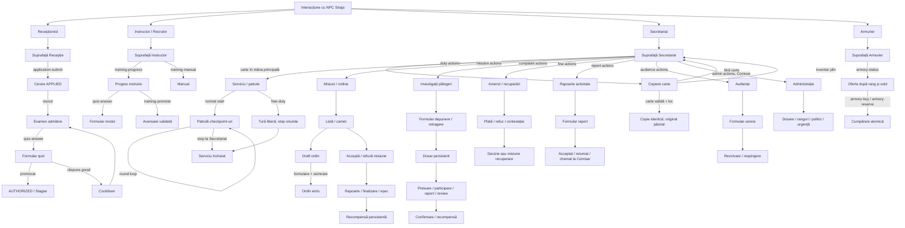
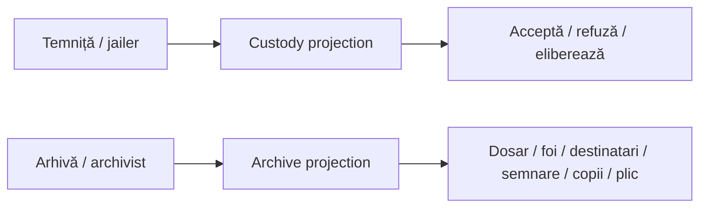

# Straja dialog trees

This document is the audit source for every player-facing NPC path in the
current build. The canonical UX is the native Straja clickable-chat/form
surface. `NpcFaqSurface` owns read-only explanations; `NpcPlayerSurface` and
`NpcRoles` own the operational menus. CustomNPCs JSON is not an authority or
runtime dependency.

## Physical layout and spawn contract

```text
Parter       -> Recepționist + Instructor/Recrutor, cameră comună
Etajul 1     -> Secretariat în stânga după urcare + biroul Comisarului
Etajul 2     -> camerele Străjerilor + camera de schimb/Armurieră
Subsol       -> închisoare
```

There are four physical officials: Receptionist, Instructor/Recrutor, Secretary
and Armorer. `recruiter` is a compatibility alias that resolves to the
Instructor and is never spawned separately.

`/straja setup npcs` uses the configured locations instead of spawning a row
beside the executor. Before spawning, configure `receptionist`, `trainer`,
`secretary` and `armorer` with `/straja set-location <name>`. The command refuses
to partially spawn NPCs when a required location or dimension is missing.

## End-to-end layer graph

```mermaid
flowchart LR
    E[EntityInteract] --> O[StrajaEvents / registry ownership]
    O --> I[NpcRoles.interact]
    I --> S[NpcPlayerSurface + state projections]
    S --> T[short-lived player-bound token]
    T --> C[/straja npc-action]
    C --> D[NpcRoles.performAction]
    D --> P[inbound roleplay use-case]
    P --> V[service/domain validation]
    V --> W[SavedData + audit + PlayerGateway]
```

The event adapter may route or suppress a host NPC interaction, but it does not
grant authority. FAQ actions are read-only. Mutating actions are revalidated by
the use case at dispatch time, so stale menus, forged record IDs, wrong roles,
wrong ranks, wrong locations and repeated tokens fail closed.

## Native interaction graph



The optional `jailer` and `archivist` routes remain available for explicitly
bound NPCs, but they are not part of the four-NPC physical setup:



## FAQ tree and rank gates

Every physical surface exposes `Am o întrebare`. Each answer returns to its
category; the category offers `Înapoi la întrebări`. The target is encoded in an
allowlisted action ID and is parsed again at dispatch.

```mermaid
flowchart TD
    F[Am o întrebare] --> P[Despre Strajă]
    F --> E[Înscriere și examen]
    F --> G[Grad și drepturi]
    F --> D[Reguli, plângeri și amenzi]
    F --> L[Locații]
    F --> H[Ce pot face aici?]
    F -.-> ST[Statutul meu: membru / istoric]
    F -.-> DU[Serviciu și patrule: membru activ]
    F -.-> M[Misiuni, rapoarte și audiențe: membru activ]
    F -.-> EC[Monede și echipament: membru activ]
    F -.-> AD[Comisar: commissioner gate]

    P --> P1[Ce este Straja?]
    P --> P2[Ce grade există?]
    P --> P3[Pot rămâne în facțiunea mea?]
    E --> E1[Cum intru?]
    E --> E2[Ce se întâmplă cu cererea?]
    E --> E3[Cum funcționează examenul?]
    E --> E4[Ce se întâmplă dacă pic?]
    E --> E5[Ce primesc după promovare?]
    G --> G1[Statut și grad]
    G --> G2[Drepturile gradului]
    G --> G3[Promovare]
    D --> D1[Plângere]
    D --> D2[Amendă]
    D --> D3[Disciplină]
    L --> L1[Parter]
    L --> L2[Etajul 1]
    L --> L3[Etajul 2]
    L --> L4[Subsol]
    ST --> ST1[Statut curent]
    ST --> ST2[De ce nu pot începe?]
    ST --> ST3[Revenire]
    DU --> DU1[Start]
    DU --> DU2[Checkpoint-uri]
    DU --> DU3[Stop normal / free-duty]
    DU --> DU4[Rapoarte]
    M --> M1[Misiuni]
    M --> M2[Raport de activitate]
    M --> M3[Audiență]
    EC --> EC1[Salariu]
    EC --> EC2[Monede]
    EC --> EC3[Echipament]
    EC --> EC4[Cumpărare blocată]
    AD --> AD1[Personal]
    AD --> AD2[Urgență]
    AD --> AD3[Audit]
    H --> H1[Recepție]
    H --> H2[Instructor/Recrutor]
    H --> H3[Secretariat + copiere cărți]
    H --> H4[Armurier]
```



| Context | Visible FAQ branches |
| --- | --- |
| Civil | About, entry, rank, rules, locations, current NPC |
| Application submitted / invited | Civil branches plus status and recruitment explanations |
| Active member | Public branches plus status, duty, missions and economy |
| Suspended / resigned / fired | Public branches plus status and recovery explanations; operational branches hidden |
| Comisar | Active branches plus administration, emergency and audit explanations |

The FAQ never authorizes an action. Rank and lifecycle state control visibility;
the application services remain the final authority.

## Book-copy contract

Book copying is an implicit Secretary interaction, not a clickable dialog option:
the player holds a book in the main hand and right-clicks the Secretary. The
server copies one item into the inventory, preserves all item components, keeps
the original and reports `NO_SPACE` without claiming success when insertion
fails.

The canonical Minecraft definition of a copyable book is the item tag
`#minecraft:bookshelf_books`, which covers vanilla books and modded books that
register themselves with the standard book tag. This boundary prevents the
Secretary from duplicating arbitrary held items.

## Role surface inventory

| NPC | Base options | Contextual options / owner |
| --- | --- | --- |
| Recepționist | application, rules, status, fines, room, native faction, FAQ | complaints, fine payment/appeal, room release — role-aware use cases |
| Instructor/Recrutor | training progress, manual, FAQ | admission exam/quiz for valid applicants; training quiz and promotion |
| Secretară | book copy by interaction, missions, carnet, duty status, FAQ | duty, missions, complaints, fines, reports, audiences and Comisar administration |
| Armurieră | offers, service kit, FAQ | coin and requisition purchases gated by current offers |
| Jailer (optional) | custody, sentence, downed status, cuffs, FAQ | custody requests and releases |
| Archivist (optional) | folders, FAQ | authorized archive folder/sheet/document flows |

## Source-of-truth files

- FAQ text, questions, gating and answer return paths:
  `src/main/java/com/dwurdy/straja/adapter/in/npc/NpcFaqSurface.java`
- Role surfaces and projection-to-action mapping:
  `src/main/java/com/dwurdy/straja/adapter/in/npc/NpcPlayerSurface.java`
- Token dispatch, fresh validation and role ownership:
  `src/main/java/com/dwurdy/straja/adapter/in/npc/NpcRoles.java`
- Entity event routing and Secretary book interception:
  `src/main/java/com/dwurdy/straja/adapter/in/event/StrajaEvents.java`
- Player-facing design target and physical layout:
  `docs/gameplay-decisions.md`

## CustomNPCs profile inventory

The current workspace contains only the generic static trees:

```text
rustic-craft-server/world/customnpcs/dialogs/Villager/1.json
rustic-craft-server/world/customnpcs/dialogs/Villager/2.json
rustic-craft-server/world/customnpcs/dialogs/Villager/3.json
```

There is no `StrajaReception` JSON tree in the current profile. These generic
trees are informational only. The Straja mod uses native `StrajaNpcEntity`
surfaces and does not delegate authority to CustomNPCs dialogs. If a bound
foreign NPC is used, the Straja role registry owns the interaction and routes it
through the same native surfaces.
